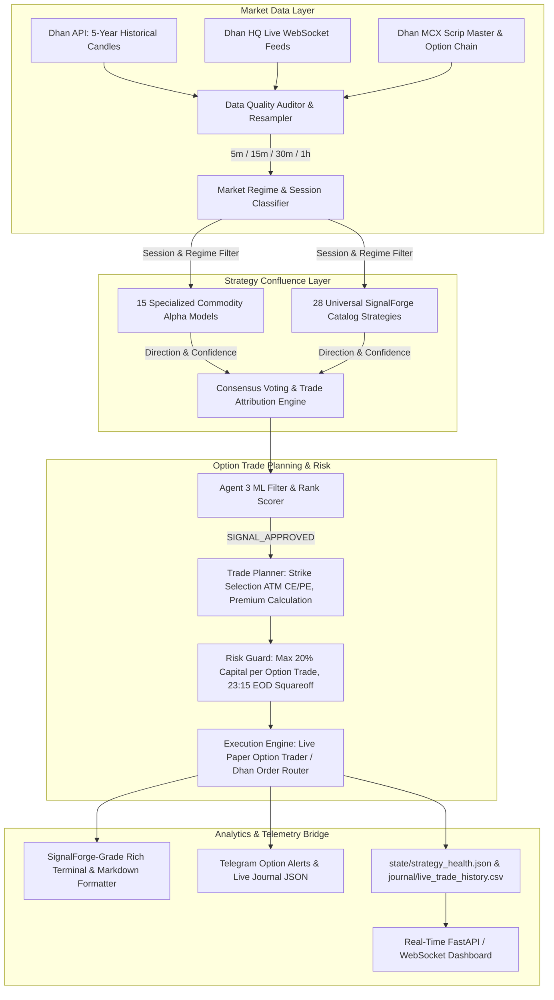

# MCXForge — Institutional Commodity Option Buying Platform (BUY CALL / BUY PUT)

**MCXForge** is an event-driven, institutional algorithmic trading and quantitative research platform purpose-built for **Commodity Option Buying (BUY CALL / BUY PUT ONLY)**, starting with **SILVERM** (Silver Mini Options: 5 kg lot size, ₹5.00/point tick value, 500-point strike steps).

### Core Trading Philosophy: Pure Option Buying
- **Directional Option Buying ONLY**: Bullish confluence triggers **BUY CALL (CE)**; bearish confluence triggers **BUY PUT (PE)**.
- **Strictly Capped Risk**: Maximum loss per trade is strictly limited to 100% of the premium paid. No naked futures margin calls, no option writing/shorting risk.
- **Dhan HQ Contract Master Integration**: Real-time ATM / near-ATM strike selection and security ID resolution using Dhan's live MCX scrip master (`data/cache/dhan_scrip_master.csv`, e.g. `SILVERM-24Sep2026-285000-CE` and `SILVERM-24Sep2026-285000-PE`).
- **Physical Delivery Protection**: Automatic rollover and lockout before tender periods.
- **Statutory Cost & Tax Modeling**: Exact exchange transaction charges (brokerage, CTT, exchange turnover, SEBI fees, GST, stamp duty).
- **Session Liquidity Focus**: Capitalizes on evening US COMEX overlap (17:00–23:30 IST) where commodity option delta expansion and volatility momentum are highest.

---

## 1. Key Capabilities & Architecture



### Institutional Strategy Suite (27 SignalForge Catalog + 15 Specialized Commodity Models)

#### A. 27 Core SignalForge Strategies
All 27 strategies from the master catalog are actively evaluated and contributing in MCXForge:
1. `SuperTrend+RSI`: Trend flip with momentum filter.
2. `VWAP+EMA`: Intraday VWAP & EMA crossover mean-reversion.
3. `ORB`: Opening range breakout (09:00–09:30).
4. `BBSqueeze`: Volatility squeeze expansion with Stochastic filter.
5. `ADX+PSAR`: Strong directional trend with Parabolic SAR flip.
6. `FVG`: Fair Value Gap / Smart Money imbalance zones.
7. `UTBot`: Key-value ATR crossover trailing stop.
8. `CPR`: Central Pivot Range breakout.
9. `Ichimoku`: Multi-timeframe cloud & tenkan/kijun confluence.
10. `VolumeProfile`: VPOC & Value Area high/low level reaction.
11. `LiqSweep`: Stop hunt reversal detection at swing extremes.
12. `PriceAction`: Candlestick pattern recognition at structural levels.
13. `OIAnalysis`: Institutional volume & open interest accumulation.
14. `AMD`: Accumulation, Manipulation, Distribution cycle detection.
15. `GapDirection`: Opening gap continuation/fade alignment.
16. `SMC`: Smart Money Concepts order blocks & structure break.
17. `ValueArea`: Value Area 70% volume distribution retests.
18. `GapMomentum`: Opening momentum thrust continuation.
19. `ADXRising`: Accelerating directional trend filter.
20. `RangeSpread`: Range-bound spread fade & mean reversion.
21. `SqueezeMomentum`: John Carter squeeze momentum indicator.
22. `StochRSI`: Oversold/overbought momentum extremes.
23. `EMASlope`: Moving average velocity and angle acceleration.
24. `HeikinAshi`: Smoothed trend continuation bars.
25. `VWAPExtreme`: Multi-standard-deviation VWAP bands.
26. `OpeningRangeBias`: Early session bias alignment.
27. `ElliottWave`: Impulse & corrective wave projection.

#### B. 15 Specialized MCX Commodity Alpha Strategies
1. **Enhanced VWAP Reversion** (`core/strategies/vwap_mean_reversion.py`)
2. **Opening Range Breakout (ORB)** (`core/strategies/orb.py`)
3. **Bollinger Band Mean Reversion** (`core/strategies/bb_mean_reversion.py`)
4. **Dual Moving Average Crossover** (`core/strategies/ma_crossover.py`)
5. **RSI Divergence** (`core/strategies/rsi_divergence.py`)
6. **Volatility Breakout** (`core/strategies/volatility_breakout.py`)
7. **Donchian Breakout** (`core/strategies/donchian_breakout.py`)
8. **Momentum Volume Breakout** (`core/strategies/momentum_volume_breakout.py`)
9. **Gold-Silver Pairs Trading** (`core/strategies/gold_silver_pairs.py`)
10. **Order Flow & Cumulative Delta Imbalance** (`core/strategies/order_flow_delta.py`)
11. **Time-of-Day Seasonality** (`core/strategies/time_of_day_seasonality.py`)
12. **Calendar Seasonality** (`core/strategies/calendar_seasonality.py`)
13. **Contango / Backwardation Term Structure** (`core/strategies/term_structure.py`)
14. **Currency Macro Overlay Filter** (`core/strategies/currency_macro_filter.py`)
15. **Larry Connors RSI(2)** (`core/strategies/rsi2_mean_reversion.py`)

---

## 2. Market Research Discoveries & Session Asymmetry

A comprehensive grid sweep across 22,330 historical candles (`SILVERMIC_dhan_5m.csv`) revealed that **MCX Session Timing dominates profitability**:

| Timeframe | Morning (09:00–13:00 IST) | Afternoon (13:00–17:00 IST) | Evening (17:00–23:30 IST) | Full Day (All Hours) |
|---|---|---|---|---|
| **5m** | ₹-13,782 (PF 0.77) | ₹-13,767 (PF 0.67) | **+₹5,672** (PF 1.44) | ₹-15,483 (PF 1.05) |
| **15m** | ₹-12,789 (PF 0.60) | ₹-5,839 (PF 0.79) | **+₹15,986** (PF 2.31, Win: 64%) | ₹-3,693 (PF 1.07) |
| **30m** | ₹-8,131 (PF 0.72) | ₹-4,953 (PF 0.81) | **+₹20,381** (PF 2.43, Win: 61%) | +₹6,636 (PF 1.29) |
| **1h** | ₹-22,218 (PF 0.15) | ₹-13,725 (PF 0.37) | **+₹45,397** (PF 1.38, Win: 49%) | ₹-5,658 (PF 0.82) |

- **Why Morning/Afternoon Fails**: MCX silver trades with low domestic volume during Asian hours, causing false breakouts and repeated whipsaw stopouts.
- **Why Evening Dominates**: US COMEX and European markets open from 17:00 IST onwards, injecting sustained institutional trend velocity and volume.
- **Why 1-Hour Timeframe Wins**: On `5m`/`15m`, statutory costs and 1-tick slippage eat up to 40% of small moves. On `1h`, moves are 800–2,500 silver points, making statutory transaction costs negligible (< 4% of gains).

### Golden Institutional Ensemble (1-Hour, min_votes=2)
- **Total Trades**: 95
- **Win Rate**: **51.6%**
- **Net Realized P&L**: **+₹40,372.37**
- **Profit Factor**: **1.34**
- **Expectancy**: **+₹424.97 per trade**
- **Max Drawdown**: **₹30,582.61 (14.1%)**
- **Sharpe Ratio**: **1.49**

---

## 3. Quick Start

### A. Environment Configuration
Copy `.env` from template and verify credentials:
```bash
# Set your Dhan permanent tokens in .env
DHAN_CLIENT_ID='1111480047'
DHAN_ACCESS_TOKEN='<your_token>'
INSTRUMENT=SILVERMIC
TRADING_MODE=OBSERVE
```

### B. Daily Operations & CLI Commands

1. **Run Full Test Suite**:
   ```bash
   ./venv/bin/pytest tests/unit -v
   ```

2. **Execute Full Multi-Strategy Ensemble Backtest**:
   ```bash
   PYTHONPATH=. ./venv/bin/python scripts/evaluate_top10_strategies.py
   ```

3. **Run Multi-Timeframe $\times$ Multi-Session Optimization Grid**:
   ```bash
   PYTHONPATH=. ./venv/bin/python core/strategies/session_grid.py --instrument SILVERMIC --data data/historical/SILVERMIC_dhan_5m.csv
   ```

4. **Launch Live Paper / Shadow Trading Runner** (09:00 – 23:30 IST):
   ```bash
   # Live market paper trading (gated to evening session edge)
   PYTHONPATH=. ./venv/bin/python scripts/live_commodity_paper_runner.py --instrument SILVERMIC --timeframe 1h --session-filter EVENING_ONLY

   # Dry-run test anytime outside market hours:
   PYTHONPATH=. ./venv/bin/python scripts/live_commodity_paper_runner.py --instrument SILVERMIC --timeframe 1h --dry-run
   ```

---

## 4. Directory Structure

| Path | Purpose |
|---|---|
| `core/strategies/` | 19 institutional commodity strategies, ensemble engine, and session grid |
| `instruments/` | MCX physical specs (tick size, lot size, margin, tender period lockout) |
| `data/historical/` | 5 full years of daily & 1-year of 5m continuous Dhan market data |
| `backtests/` | Master markdown reports, grid CSV summaries, and audit logs |
| `scripts/` | Live paper trading runner, strategy evaluators, broker authenticators |
| `utils/` | Brokerage calculators, rich report formatters, and telemetry loggers |
| `state/` | Persistent live paper journal (`live_paper_journal.json`) |
