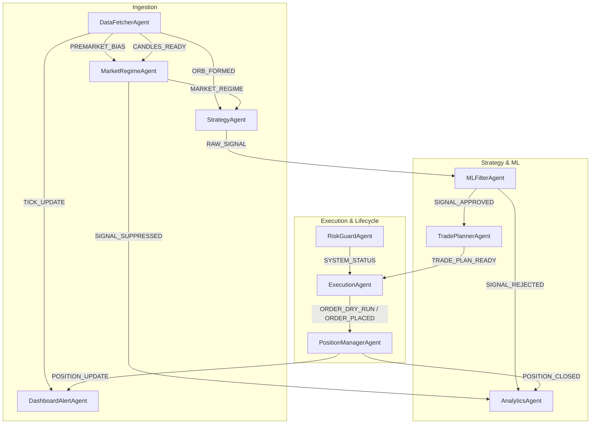

# MCXForge — Message Bus API Reference

Complete topic reference for the internal asynchronous pub/sub message bus (`core/bus.py`).
Update this specification whenever you add or modify a `Topic` enum or payload contract.

**MCXForge** is an event-driven algorithmic trading and research platform engineered for **Commodity Option Buying (BUY CALL / BUY PUT ONLY)**, starting with **SILVERM** (Silver Mini Options). It facilitates seamless communication among autonomous agents spanning data ingestion, market regime classification, multi-strategy ensemble, ML quality filtering, ATM/near-ATM option contract planning, paper/broker execution, capped-risk position management, risk governance, and analytics.

---

## Bus Architecture Overview



---

## Topic Definitions

### 1. Data Layer

#### `PREMARKET_BIAS`
Broadcasts early physical/global commodity cues, DXY status, and opening gap direction prior to MCX 09:00 IST open.
- **Publisher:** `DataFetcherAgent` (Agent 1)
- **Subscribers:** `AnalyticsAgent` (Agent 7), `MarketRegimeAgent` (Agent 9)
```json
{
  "symbol": "SILVERMIC",
  "bias": "BULLISH | BEARISH | NEUTRAL",
  "comex_silver_change_pct": 1.15,
  "dxy_index": 104.20,
  "usdinr_rate": 86.85,
  "gap_pct": 0.45,
  "prev_close": 85200.0,
  "timestamp": "2026-09-05T08:55:00+05:30"
}
```

#### `CANDLES_READY`
Published at the close of every bar (e.g. 5m, 15m, 30m, 1h) with normalized OHLCV data.
- **Publisher:** `DataFetcherAgent` (Agent 1)
- **Subscribers:** `MarketRegimeAgent` (Agent 9), `StrategyAgent` (Agent 2), `MLFilterAgent` (Agent 3), `PositionManagerAgent` (Agent 6)
```json
{
  "symbol": "SILVERMIC",
  "timeframe": "1h",
  "session": "EVENING",
  "candles": [
    {
      "timestamp": "2026-09-05 18:00:00+05:30",
      "open": 85200.0,
      "high": 85650.0,
      "low": 85150.0,
      "close": 85580.0,
      "volume": 480,
      "open_interest": 12450
    }
  ],
  "ltp": 85580.0,
  "orb_high": 85400.0,
  "orb_low": 84950.0,
  "timestamp": "2026-09-05T19:00:05+05:30"
}
```

#### `ORB_FORMED`
Announces that the Opening Range Breakout (ORB) levels have locked after the first 15 or 30 minutes of trading (09:00–09:30 IST).
- **Publisher:** `DataFetcherAgent` (Agent 1)
- **Subscribers:** `StrategyAgent` (Agent 2), `DashboardAlertAgent` (Agent 8)
```json
{
  "symbol": "SILVERMIC",
  "orb_high": 85400.0,
  "orb_low": 84950.0,
  "orb_range": 450.0,
  "orb_timeframe": "30m",
  "timestamp": "2026-09-05T09:30:00+05:30"
}
```

#### `TICK_UPDATE`
Real-time tick feed update from Dhan HQ WebSocket/polling stream.
- **Publisher:** `DataFetcherAgent` (Agent 1)
- **Subscribers:** `DashboardAlertAgent` (Agent 8), `PositionManagerAgent` (Agent 6)
```json
{
  "symbol": "SILVERMIC",
  "security_id": "562058",
  "ltp": 85580.0,
  "bid": 85575.0,
  "ask": 85585.0,
  "volume_day": 14200,
  "timestamp": "2026-09-05T19:05:22+05:30"
}
```

---

### 2. Regime Layer

#### `MARKET_REGIME`
Emitted by the Market Regime Classifier to describe volatility, session phase, and directional trend context.
- **Publisher:** `MarketRegimeAgent` (Agent 9)
- **Subscribers:** `StrategyAgent` (Agent 2), `MLFilterAgent` (Agent 3), `DashboardAlertAgent` (Agent 8)
```json
{
  "symbol": "SILVERMIC",
  "regime": "TRENDING",
  "session": "EVENING",
  "adx": 28.5,
  "plus_di": 26.4,
  "minus_di": 14.1,
  "chop_index": 41.2,
  "atr_14": 380.0,
  "is_tender_period": false,
  "timestamp": "2026-09-05T19:00:10+05:30"
}
```

#### `SIGNAL_SUPPRESSED`
Published when trading is suppressed due to Asian-session chop, pre-expiry physical delivery tender lockout, or ultra-low ADX.
- **Publisher:** `MarketRegimeAgent` (Agent 9)
- **Subscribers:** `AnalyticsAgent` (Agent 7), `DashboardAlertAgent` (Agent 8)
```json
{
  "symbol": "SILVERMIC",
  "regime": "CHOPPY",
  "reason": "ADX=14.2 below 20 and Morning Session noise filter active",
  "details": {
    "session": "MORNING",
    "adx": 14.2,
    "tender_lockout": false
  },
  "timestamp": "2026-09-05T10:45:00+05:30"
}
```

---

### 3. Strategy Layer

#### `RAW_SIGNAL`
Aggregated consensus signal generated by the 19 registered institutional commodity strategy suite.
- **Publisher:** `StrategyAgent` (Agent 2)
- **Subscribers:** `MLFilterAgent` (Agent 3)
```json
{
  "symbol": "SILVERMIC",
  "direction": "BUY",
  "timeframe": "1h",
  "confidence": 0.76,
  "votes": 4,
  "strategies_fired": [
    "TrendFollowing",
    "MomentumVolumeBreakout",
    "DonchianBreakout",
    "TimeOfDaySeasonality"
  ],
  "ltp": 85580.0,
  "metadata": {
    "TrendFollowing": {"adx": 28.5, "fast_ema": 85450.0},
    "MomentumVolumeBreakout": {"vol_ratio": 1.72, "macd_hist": 45.2},
    "DonchianBreakout": {"channel_high": 85400.0},
    "TimeOfDaySeasonality": {"window": "US_COMEX_OPEN", "ist_time": "18:00"}
  },
  "timestamp": "2026-09-05T19:00:15+05:30"
}
```

---

### 4. ML & Filtering Layer

#### `SIGNAL_APPROVED`
Published when the ML classifier and macro overlays confirm statistical expectancy.
- **Publisher:** `MLFilterAgent` (Agent 3)
- **Subscribers:** `TradePlannerAgent` (Agent 4), `DashboardAlertAgent` (Agent 8)
```json
{
  "symbol": "SILVERMIC",
  "direction": "BUY",
  "timeframe": "1h",
  "confidence": 0.76,
  "votes": 4,
  "strategies_fired": ["TrendFollowing", "MomentumVolumeBreakout", "DonchianBreakout"],
  "ml_confidence": 0.71,
  "ml_rank_tier": "TIER_1",
  "ml_approved": true,
  "macro_filter_passed": true,
  "position_size_factor": 1.0,
  "timestamp": "2026-09-05T19:00:20+05:30"
}
```

#### `SIGNAL_REJECTED`
Published when a signal is rejected due to low ML win probability or macro currency shock.
- **Publisher:** `MLFilterAgent` (Agent 3)
- **Subscribers:** `AnalyticsAgent` (Agent 7), `DashboardAlertAgent` (Agent 8)
```json
{
  "symbol": "SILVERMIC",
  "direction": "BUY",
  "ml_confidence": 0.46,
  "ml_approved": false,
  "rejection_reason": "ML confidence 0.46 < threshold 0.55",
  "timestamp": "2026-09-05T19:00:20+05:30"
}
```

---

### 5. Planning Layer

#### `TRADE_PLAN_READY`
Complete trade plan specifying resolved Dhan options contract (`SILVERM-24Sep2026-285000-CE/PE`), strike, option type, lot sizing, capital/premium required, SL/target, and physical delivery safety check.
- **Publisher:** `TradePlannerAgent` (Agent 4)
- **Subscribers:** `ExecutionAgent` (Agent 5), `AnalyticsAgent` (Agent 7), `DashboardAlertAgent` (Agent 8), `RiskGuardAgent` (Agent 10)
```json
{
  "symbol": "SILVERM",
  "contract": "SILVERM-24Sep2026-285000-CE",
  "security_id": "562058",
  "direction": "BUY_CALL",
  "strike": 285000,
  "option_type": "CE",
  "lots": 1,
  "lot_size": 5,
  "unit": "KG",
  "spot_price": 285000.0,
  "entry_premium": 6655.5,
  "sl_premium": 5324.4,
  "target_premium": 9317.7,
  "capital_required": 33277.5,
  "max_loss_budget": 33277.5,
  "tender_period_safe": true,
  "expiry_date": "2026-09-24",
  "estimated_charges": {
    "brokerage": 20.0,
    "exchange_turnover": 4.1,
    "ctt": 0.0,
    "gst": 4.34,
    "stamp_duty": 1.0,
    "total_statutory": 29.44
  },
  "timestamp": "2026-09-05T19:00:25+05:30"
}
```

---

### 6. Execution Layer

#### `ORDER_DRY_RUN`
Simulated order emission in `TRADING_MODE=OBSERVE` (paper trading runner).
- **Publisher:** `ExecutionAgent` (Agent 5)
- **Subscribers:** `PositionManagerAgent` (Agent 6), `AnalyticsAgent` (Agent 7), `DashboardAlertAgent` (Agent 8)
```json
{
  "order_id": "PAPER_MCX_190025",
  "symbol": "SILVERMIC",
  "contract": "SILVERMIC26NOVFUT",
  "direction": "BUY",
  "lots": 1,
  "fill_price": 85580.0,
  "mode": "OBSERVE",
  "simulated": true,
  "timestamp": "2026-09-05T19:00:25+05:30"
}
```

#### `ORDER_CONFIRM_REQ`
Requests manual confirmation in `TRADING_MODE=MANUAL`.
- **Publisher:** `ExecutionAgent` (Agent 5)
- **Subscribers:** `DashboardAlertAgent` (Agent 8)
```json
{
  "order_id": "REQ_190025",
  "contract": "SILVERMIC26NOVFUT",
  "direction": "BUY",
  "lots": 1,
  "price": 85580.0,
  "expires_in_seconds": 180,
  "timestamp": "2026-09-05T19:00:26+05:30"
}
```

#### `ORDER_PLACED`
Confirms live broker execution via Dhan HQ / Upstox / Kite in `TRADING_MODE=AUTO`.
- **Publisher:** `ExecutionAgent` (Agent 5)
- **Subscribers:** `PositionManagerAgent` (Agent 6), `AnalyticsAgent` (Agent 7), `DashboardAlertAgent` (Agent 8)
```json
{
  "order_id": "DHAN_881920194",
  "symbol": "SILVERMIC",
  "contract": "SILVERMIC26NOVFUT",
  "direction": "BUY",
  "lots": 1,
  "fill_price": 85582.0,
  "slippage_points": 2.0,
  "mode": "AUTO",
  "simulated": false,
  "timestamp": "2026-09-05T19:00:27+05:30"
}
```

---

### 7. Position & Lifecycle Layer

#### `POSITION_UPDATE`
Point-by-point MTM and trailing stop telemetry emitted per price update or candle.
- **Publisher:** `PositionManagerAgent` (Agent 6)
- **Subscribers:** `DashboardAlertAgent` (Agent 8)
```json
{
  "position_id": "POS_SILVERMIC_01",
  "symbol": "SILVERMIC",
  "contract": "SILVERMIC26NOVFUT",
  "direction": "BUY",
  "lots": 1,
  "entry_price": 85580.0,
  "current_ltp": 86120.0,
  "current_sl": 85340.0,
  "unrealized_points": 540.0,
  "unrealized_pnl": 540.0,
  "trailing_active": true,
  "timestamp": "2026-09-05T20:15:00+05:30"
}
```

#### `POSITION_CLOSED`
Published upon trade exit (Target, Trailing SL, Physical Delivery Cutoff, or EOD Intraday Squareoff at 23:25 IST).
- **Publisher:** `PositionManagerAgent` (Agent 6)
- **Subscribers:** `StrategyAgent` (Agent 2), `ExecutionAgent` (Agent 5), `AnalyticsAgent` (Agent 7), `DashboardAlertAgent` (Agent 8), `RiskGuardAgent` (Agent 10)
```json
{
  "position_id": "POS_SILVERMIC_01",
  "symbol": "SILVERMIC",
  "contract": "SILVERMIC26NOVFUT",
  "direction": "BUY",
  "lots": 1,
  "entry_price": 85580.0,
  "exit_price": 86240.0,
  "gross_points": 660.0,
  "gross_pnl": 660.0,
  "statutory_costs": 38.45,
  "net_pnl": 621.55,
  "exit_reason": "TRAILING_SL | TARGET_HIT | SL_HIT | SESSION_CLOSE | TENDER_LOCKOUT",
  "entry_time": "2026-09-05T19:00:25+05:30",
  "exit_time": "2026-09-05T21:30:10+05:30",
  "simulated": true,
  "timestamp": "2026-09-05T21:30:11+05:30"
}
```

---

### 8. Analytics & Reporting Layer

#### `EOD_REPORT_READY`
Summary of all commodity trades, session breakdown, win rate, statutory fee deductions, and net returns.
- **Publisher:** `AnalyticsAgent` (Agent 7)
- **Subscribers:** `DashboardAlertAgent` (Agent 8)
```json
{
  "date": "2026-09-05",
  "instrument": "SILVERMIC",
  "session": "EVENING",
  "trades_count": 3,
  "wins": 2,
  "losses": 1,
  "win_rate": 66.7,
  "gross_pnl": 1420.0,
  "total_statutory_costs": 114.80,
  "net_pnl": 1305.20,
  "profit_factor": 2.15,
  "journal_path": "journal/commodity_signals_2026-09-05.csv",
  "timestamp": "2026-09-05T23:35:00+05:30"
}
```

---

### 9. Risk & Governance Layer

#### `SYSTEM_STATUS`
Enforces emergency halt, risk tripwires, or tender period lockout across the entire cluster.
- **Publisher:** `RiskGuardAgent` (Agent 10)
- **Subscribers:** `ExecutionAgent` (Agent 5), `DashboardAlertAgent` (Agent 8)
```json
{
  "trading_enabled": false,
  "status": "HALTED",
  "reason": "Max daily loss limit of ₹5,000 reached or Tender Period Lockout",
  "source": "RiskGuardAgent",
  "realized_daily_pnl": -5120.0,
  "timestamp": "2026-09-05T21:40:00+05:30"
}
```
