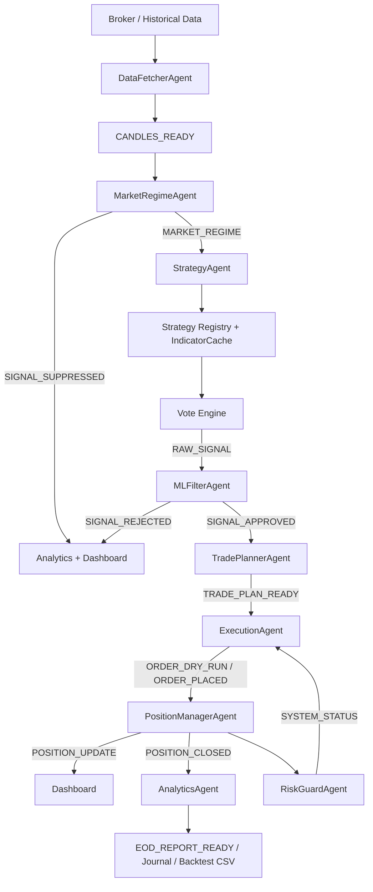
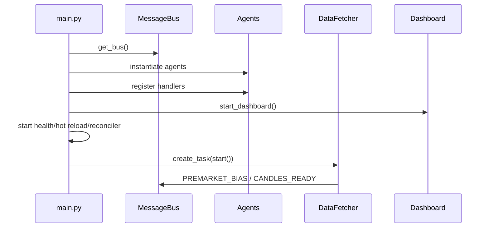
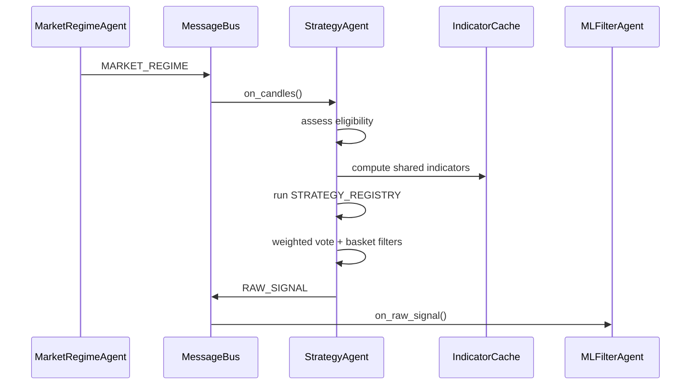
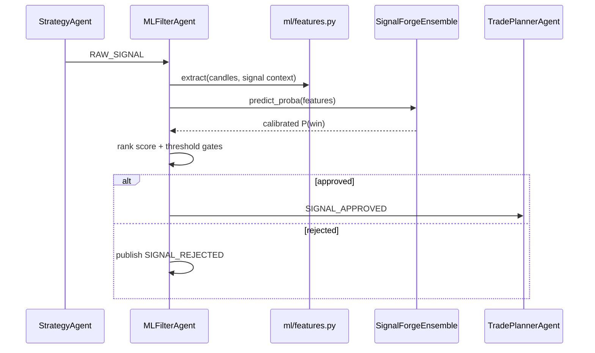
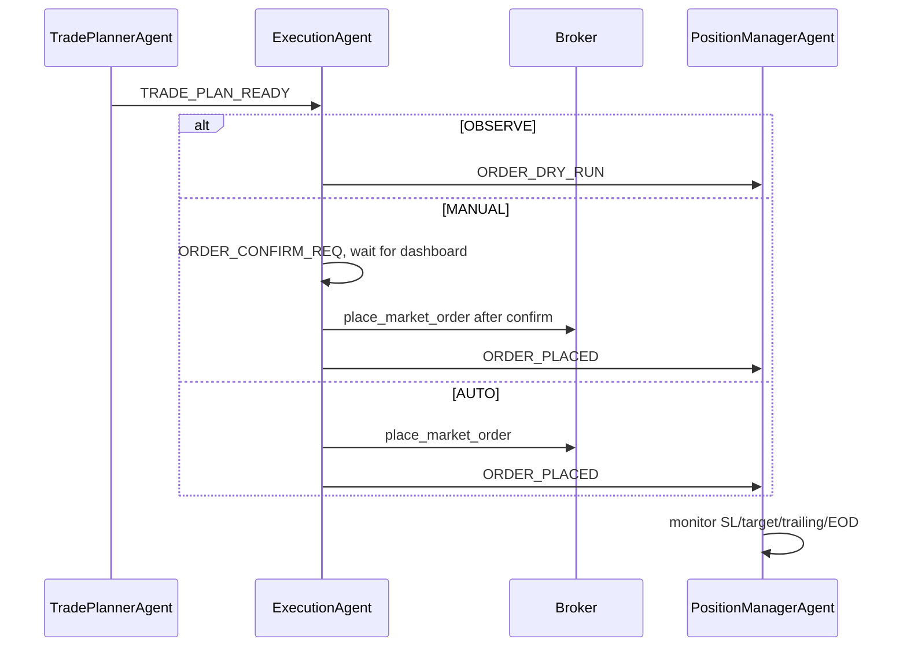
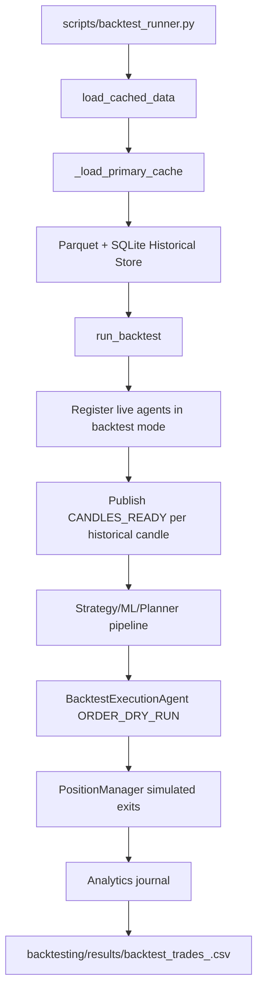
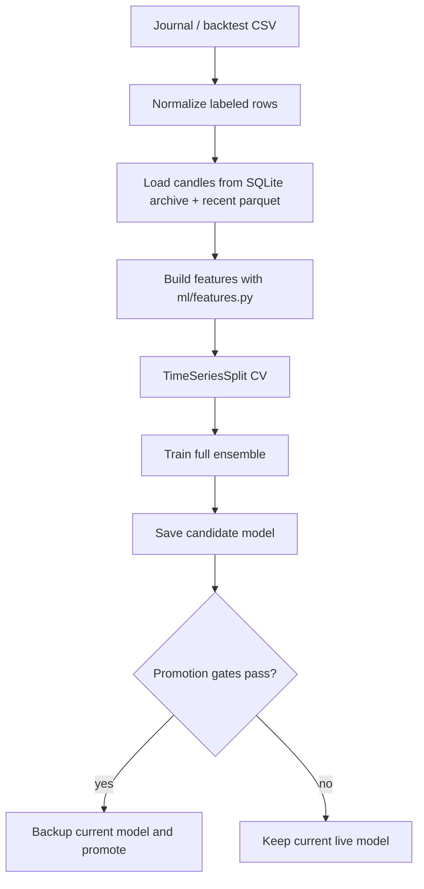
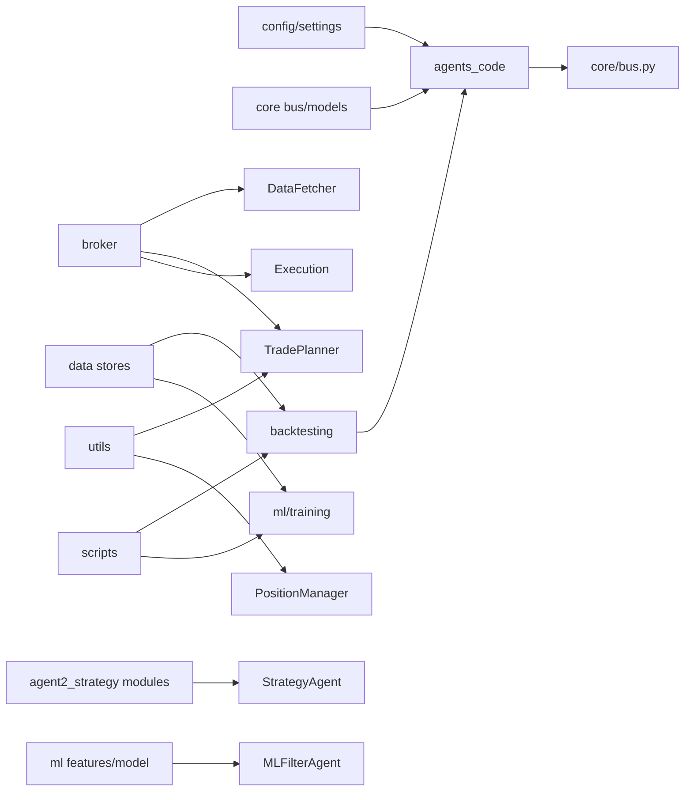

# MCXForge & SignalForge Architecture Reference

This is the canonical technical architecture specification for **MCXForge** — an institutional quantitative platform purpose-built for **Commodity Option Buying (BUY CALL / BUY PUT ONLY)**, starting with **SILVERM** (Silver Mini Options: 5 kg lot size, ₹5.00/point tick value, 500-point strike step).

Last reviewed against source: 2026-09-05.

## Documentation Map

| Document | Purpose | Notes |
|---|---|---|
| `README.md` | Quick start, option buying catalog, and operator orientation | Summary of strategies, grid findings, and CLI commands. |
| `docs/architecture.md` | Canonical architecture, option mechanics, strategies, and backtest design | This document. |
| `docs/api-reference.md` | Message bus topic payload reference | Topic schema and payload contracts. |
| `docs/onboarding.md` | Operator setup and daily workflow | Broker auth, Dhan feeds, and live paper option trading. |
| `skills/*/SKILL.md` | Agent-specific quick references | Helper notes for subagent execution. |

## Project Overview

**MCXForge** is an event-driven quantitative trading and research platform engineered for **Commodity Option Buying (BUY CALL / BUY PUT ONLY)**, focused on **SILVERM**. It incorporates physical delivery tender-period risk governance, statutory MCX transaction fees, multi-session liquidity asymmetry (Morning, Afternoon, Evening US COMEX overlap), consensus voting across the institutional strategy ensemble, ATM/near-ATM option strike selection via Dhan HQ's MCX contract scrip master, capped downside risk (strictly premium paid), and a live paper/shadow execution runner.

### Goals

| Goal | Implementation |
|---|---|
| Broker abstraction | `broker/base_broker.py` defines the interface; `broker/factory.py` loads Dhan, Upstox, Groww, Kite, or yfinance from `BROKER`. |
| Decoupled agents | Runtime agents communicate through `core/bus.py`; most agents do not call each other directly. |
| Pure Option Buying | Bullish setups buy ATM/near-ATM Call options (`BUY_CALL`), bearish setups buy Put options (`BUY_PUT`). No option writing/selling. |
| Safe progression | `TRADING_MODE=OBSERVE`, `MANUAL`, or `AUTO` controls execution behavior in `ExecutionAgent`. |
| Reusable live/backtest pipeline | Backtests replay historical candles through the same bus and most live agents. |
| Observability | Journals, logs, EOD reports, dashboard events, pipeline traces, and backtest CSVs are written to `journal/`, `logs/`, and `analysis/`. |
| Fail-soft behavior | Broker calls and agent handlers catch errors; cached Dhan LTP and scrip master fallback for network/DNS failures. |

### Design Philosophy

- Underlying commodity price action and market structure drive signals; the trade planner selects and maps the corresponding Dhan option contracts (`SILVERM-24Sep2026-285000-CE/PE`).
- Trades are strictly **BUY CALL / BUY PUT ONLY**. Risk is strictly capped to the premium paid, protecting the fund against runaway gap-risk or margin expansion.
- Strategies vote independently; no single indicator or setup should trigger an unconfirmed trade decision.
- Consensus voting (minimum votes $\ge 2$ or $\ge 3$) provides robust signal filtering across differing market conditions.
- Macro overlays (USD-INR currency shock filter, calendar seasonality) sit atop technical strategies to dynamically scale exposure.
- Risk and exit logic are explicit gates enforced after signal generation.
- Backtests are useful only when run through exact statutory transaction costs (brokerage, CTT, turnover, GST, stamp duty) and no-lookahead execution.
- Configuration belongs in `config/settings/`; thresholds should not be hardcoded in agent logic unless they are intentionally fixed constants.

## Runtime Components

`main.py` wires 12 runtime agents plus supporting services.

| Agent | File | Main Responsibility | Important Bus Topics |
|---|---|---|---|
| Data Fetcher | `agents_code/agent1_data/fetcher.py` | Broker data, premarket bias, candles, ORB, tick updates, OI recorder access | Publishes `PREMARKET_BIAS`, `CANDLES_READY`, `ORB_FORMED`, `TICK_UPDATE` |
| Market Regime | `agents_code/agent9_regime/classifier.py` | Regime classification and suppression | Subscribes `CANDLES_READY`, `PREMARKET_BIAS`; publishes `MARKET_REGIME`, `SIGNAL_SUPPRESSED` |
| Strategy Engine | `agents_code/agent2_strategy/runner.py` | Runs registered strategies, vote engine, raw signal generation | Subscribes `MARKET_REGIME`, position/order/system events; publishes `RAW_SIGNAL` |
| ML Filter | `agents_code/agent3_ml/filter.py` | Feature extraction, model inference, ML/rank/fallback gates | Subscribes `RAW_SIGNAL`, candles, regime, model reloads; publishes `SIGNAL_APPROVED`, `SIGNAL_REJECTED` |
| Trade Planner | `agents_code/agent4_planner/planner.py` | Option selection, premium estimate, SL/target, trade plan | Subscribes `SIGNAL_APPROVED`; publishes `TRADE_PLAN_READY` or rejection |
| Execution | `agents_code/agent5_execution/executor.py` | OBSERVE/MANUAL/AUTO order handling | Subscribes `TRADE_PLAN_READY`, `ORDER_CONFIRM_REQ`, `SYSTEM_STATUS`; publishes order events |
| Position Manager | `agents_code/agent6_position/manager.py` | Open position tracking, trailing stops, target/SL/EOD exits | Subscribes order/candle/regime events; publishes `POSITION_UPDATE`, `POSITION_CLOSED` |
| Analytics | `agents_code/agent7_analytics/journal.py` | Signal journal, EOD reports, alerts, live trade history | Subscribes most trade lifecycle events; publishes `EOD_REPORT_READY`, `ALERT` |
| Dashboard | `agents_code/agent8_dashboard/app.py` | Flask-SocketIO dashboard, Telegram, manual confirmation UI | Subscribes most topics; emits WebSocket/Telegram updates |
| Risk Guard | `agents_code/agent10_risk/risk_guard.py` | Daily risk state, exposure telemetry, halt/resume status | Subscribes candles/orders/positions; publishes `SYSTEM_STATUS`, `ALERT`, custom risk topics |
| Shadow Parameter Agent | `agents_code/agent11_shadow/shadow_agent.py` | Observes rejected signals and candles for parameter shadow analysis | Subscribes `SIGNAL_REJECTED`, `CANDLES_READY` |
| Lifecycle Auditor | `agents_code/agent12_lifecycle/lifecycle_auditor.py` | Audits closed trade lifecycle and candles | Subscribes `POSITION_CLOSED`, `CANDLES_READY` |

Supporting services started in `main.py`:

| Service | File | Responsibility |
|---|---|---|
| Health server | `utils/system_health.py` | HTTP health status. |
| Hot reloader | `utils/hot_reload.py` | Runtime config reload support. |
| Live position reconciler | `utils/live_position_reconciler.py` | Reconcile broker positions with internal state. |
| Capital manager | `utils/capital_manager.py` | Tracks capital allocation state. |
| Audit trail | `utils/audit_trail.py` | Startup/shutdown/system audit events. |

## End-to-End Flow



### Stage Responsibilities

| Stage | Inputs | Outputs | Responsibilities | Main Code |
|---|---|---|---|---|
| Market data | Dhan HQ API or historical CSV/cache | Multi-timeframe candles (5m..1d), LTP, ORB | Ingest commodity ticks, normalize timestamps, tag session (Morning/Afternoon/Evening), publish market events | `DataFetcherAgent`, `DhanBroker`, `data/historical/` |
| Regime detection | Candles, premarket bias, session tag | `MARKET_REGIME` or `SIGNAL_SUPPRESSED` | Calculate ADX/chop, detect tender lockout windows, suppress noisy Asian session | `MarketRegimeAgent`, `regime_detector.py` |
| Indicators | Candle windows | Cached indicator series | Compute shared EMA, ATR, Bollinger, VWAP, CVD series without redundant recalculations | `IndicatorCache`, `core/strategies/` |
| Strategy engine | Regime payload, candles, ORB, macro context | Per-strategy direction/confidence | Run 19 institutional strategy families across technical, structural, and macro categories | `core/strategies/ensemble.py`, `StrategyAgent` |
| Vote engine | Strategy results | `RAW_SIGNAL` | Consensus aggregation (min votes $\ge 2$), direction grouping, conflict resolution | `core/strategies/ensemble.py` |
| ML ranking/filtering | Raw signal, recent candles, regime | `SIGNAL_APPROVED` or `SIGNAL_REJECTED` | 40+ quantitative features, model probability $P(win)$, currency shock filter | `MLFilterAgent`, `ml/features.py`, `ml/model.py` |
| Trade planning | Approved signal | `TRADE_PLAN_READY` | Pure Option Buying: Select ATM/near-ATM CE/PE contract from Dhan scrip master, cap risk to premium paid, compute ATR SL/target | `TradePlannerAgent`, `utils/brokerage_calculator.py` |
| Execution | Trade plan, mode, system status | Order events | OBSERVE paper runner, MANUAL confirmation, AUTO broker order placement | `ExecutionAgent`, `scripts/live_commodity_paper_runner.py` |
| Position management | Order event, candles, commodity LTP | Position updates/closed event | Track point-based MTM, dynamic ATR trailing stop, profit locks, 23:25 IST EOD close | `PositionManagerAgent`, `scripts/live_commodity_paper_runner.py` |
| Risk management | Orders, positions, PnL, candles | Status/halt/resume/risk topics | Enforce daily drawdown limit, margin checks, physical delivery lockout | `RiskGuardAgent`, config risk modules |
| Reporting | Lifecycle events | Journal CSV, EOD reports, dashboard/Telegram | Persist trades, calculate exact statutory MCX fees (brokerage, CTT, GST, etc.) | `AnalyticsAgent`, `DashboardAlertAgent` |
| Backtesting | Historical candles, agent pipeline | Metrics, logs, backtest CSV | Replay continuous Dhan bars, apply realistic slippage and full statutory fees | `scripts/run_commodity_backtest.py`, `backtesting/engine.py` |

## Sequence Diagrams

### Startup Flow



### Strategy Evaluation Flow



### ML Prediction Flow



### Trade Execution Flow



### Backtest Flow



## Directory Structure

| Path | Purpose | Important Files | Dependencies / Notes |
|---|---|---|---|
| `agents_code/` | Runtime agent implementations | `agent1_data` through `agent12_lifecycle` | Agents share `core.bus.Topic`, `core.models`, and config. |
| `agents_code/agent2_strategy/` | Strategy registry, strategy modules, setup/market structure | `runner.py`, `s1_*.py` to `s33_*.py`, `indicator_cache.py`, `setup_engine.py`, `market_structure.py` | Uses `pandas_ta`, `config.settings.strategy`, core direction models. |
| `core/` | Shared bus, models, LLM routing | `bus.py`, `models.py`, `llm_router.py` | Lowest-level application modules. |
| `config/settings/` | Configuration aggregation and threshold modules | `__init__.py`, `modules/*.py`, `modules/strategies/*.py`, extracted threshold files | Most runtime files import from here. |
| `broker/` | Broker abstraction and integrations | `base_broker.py`, `factory.py`, `dhan_broker.py`, `upstox_broker.py`, `groww_broker.py`, `kite_broker.py`, `yfinance_broker.py` | Broker classes implement `BaseBroker`. |
| `data/` | Persistent market data support | `historical_store.py`, `option_volume.py`, `oi_recorder.py`, `cache/`, `historical/`, `oi_history/` | SQLite historical archive plus recent Parquet caches. |
| `ml/` | Feature engineering, model ensemble, training/evaluation | `features.py`, `model.py`, `training/trainer.py`, `training/evaluate.py`, `training/walk_forward.py` | Uses scikit-learn, XGBoost, LightGBM when available. |
| `backtesting/` | Backtest engine and assumptions | `engine.py`, `options_backtester.py`, `realistic_assumptions.py`, `results/` | Reuses live agents and bus with simulated execution. |
| `scripts/` | Operational CLIs | `backtest_runner.py`, `train_ml.py`, broker auth scripts, health/debug/retrain utilities | Entry points for local operations. |
| `utils/` | Shared business utilities | Position sizing, final decision, option selection, market intelligence, trade ledger, health, notifications | Some utilities are core to planning/risk and should be treated as production code. |
| `dashboard/` | Dashboard templates | `templates/` | Used by `DashboardAlertAgent`. |
| `journal/` | Runtime signal journals and reports | `signals_*.csv`, option chain snapshots, ORB state | Generated output; useful for ML training and diagnostics. |
| `logs/` | Runtime and backtest logs | `signalforge_*.log`, `strategies_*.log`, `pipeline_trace_*.log`, backtest logs | Generated output; not architecture source. |
| `tests/` | Unit and integration tests | `tests/unit/*.py`, `tests/integration/test_pipeline.py` | Regression suite for bus, ML ranker, strategy/risk, backtest, dashboard. |
| `docs/` | Human documentation | `architecture.md`, `api-reference.md`, `onboarding.md` | `architecture.md` is canonical. |
| `skills/` | Agent skill snippets | `*/SKILL.md` | Some content is stale; use architecture/source first. |
| `pandas_ta/` | Vendored technical analysis library subset | Indicator modules | Avoid modifying unless indicator behavior requires it. |

## File-Level Documentation

| File | Purpose | Key Classes / Functions | Inputs | Outputs | Called By | Calls / Depends On |
|---|---|---|---|---|---|---|
| `main.py` | Runtime entry point | `main()`, `_eod_scheduler()` | `.env`, config, broker credentials | Running agent graph | CLI/Docker | All agents, health/reloader/reconciler |
| `core/bus.py` | Async pub/sub backbone | `Topic`, `MessageBus`, `get_bus()`, `reset_bus()` | Topic + payload dict | Concurrent handler calls, history/stats | All agents/backtests | `asyncio`, `loguru` |
| `core/models.py` | Shared domain enums/dataclasses | `Direction`, trade/signal models | Domain values | Typed models | Strategies/planner/tests | Standard library dataclasses/enums |
| `broker/base_broker.py` | Broker interface | `BaseBroker`, `OrderResult`, `PositionInfo`, `OptionContract` | Symbols/orders | Broker-independent return models | Broker implementations, agents | `abc`, `pandas` |
| `broker/factory.py` | Active broker loader | `get_broker()` | `BROKER` setting | Broker instance | Data/planner/execution | `BROKER_REGISTRY` |
| `broker/dhan_broker.py` | Dhan HTTP/SDK integration | `DhanBroker` | Dhan credentials, symbols, orders | LTP, history, option chain, orders | Broker factory | `requests`, Dhan SDK if installed |
| `agents_code/agent1_data/fetcher.py` | Live market data driver | `DataFetcherAgent` | Broker data | Bus market events | `main.py` | Broker, ORB, OI recorder |
| `agents_code/agent9_regime/classifier.py` | Market regime gate | `MarketRegimeAgent` | Candles, VIX, gap | Regime/suppression events | Bus | `regime_detector`, config thresholds |
| `agents_code/agent2_strategy/runner.py` | Strategy orchestration and vote engine | `StrategyAgent`, `STRATEGY_REGISTRY`, `_run_strategy_sync()` | Regime payload, candles, ORB, OI context | `RAW_SIGNAL` | Bus/backtest | Strategy modules, `IndicatorCache`, setup engine |
| `agents_code/agent2_strategy/indicator_cache.py` | Shared indicator cache for strategy scan | `IndicatorCache` | Candle DataFrame | EMA/RSI/ADX/VWAP/etc. series | Strategy runner/modules | `pandas_ta` |
| `agents_code/agent2_strategy/setup_engine.py` | Converts directional context into setup metadata | `TradeSetup`, `TradeSetupEngine` | Candles, direction, market structure | setup type, zones, strength | Strategy runner/planner context | `market_structure.py`, config |
| `agents_code/agent2_strategy/market_structure.py` | Structure/liquidity analysis | `MarketStructureLiquidityEngine` | Candles | BOS/ChoCH/liquidity/validation snapshot | Setup engine, strategies | pandas |
| `agents_code/agent3_ml/filter.py` | ML gate and ranking layer | `MLFilterAgent` | `RAW_SIGNAL`, candles, model file | approved/rejected signals | Bus | `ml.features`, `ml.model`, thresholds |
| `ml/features.py` | Feature engineering | `extract()`, `FEATURE_NAMES` | Candle window, signal metadata, regime | Feature dict | ML filter, trainer | pandas, technical indicators |
| `ml/model.py` | Ensemble wrapper | `SignalForgeEnsemble`, `ModelMeta` | Feature matrix or dict | P(win), saved model | Trainer, ML filter, evaluation | XGBoost, LightGBM, sklearn, joblib |
| `ml/training/trainer.py` | Training pipeline | `SignalForgeTrainer` | Journal/backtest CSVs, historical candles | Candidate/production model and metrics | `scripts/train_ml.py` | Historical cache, features, model |
| `scripts/train_ml.py` | Operational training CLI | `main()`, promotion helpers | CSV args, model thresholds | Candidate model; optional promoted model | Operator/cron | Trainer, model loader |
| `agents_code/agent4_planner/planner.py` | Converts approved signal into trade plan | `TradePlannerAgent` | `SIGNAL_APPROVED`, option chain/LTP | `TRADE_PLAN_READY` | Bus | Data agent, final decision, option utilities |
| `agents_code/agent5_execution/executor.py` | Mode-aware execution | `ExecutionAgent` | Trade plan, manual confirm, system status | order events, alerts | Bus | Broker factory/order APIs |
| `agents_code/agent6_position/manager.py` | Position lifecycle and exits | `PositionManagerAgent` | Order events, candles, regime | updates, close events, SL events | Bus | Data agent, exit utilities |
| `agents_code/agent10_risk/risk_guard.py` | Risk status and halt/resume logic | `RiskGuardAgent` | Orders, positions, candles | risk topics, `SYSTEM_STATUS` | Bus | risk config |
| `agents_code/agent7_analytics/journal.py` | Journal and reports | `AnalyticsAgent` | Trade lifecycle events | CSV rows, EOD reports, alerts | Bus | filesystem, report formatters |
| `agents_code/agent8_dashboard/app.py` | Dashboard/Telegram layer | `DashboardAlertAgent` | Bus events | Flask UI, WebSocket, Telegram | `main.py`, Bus | Flask-SocketIO, notifier |
| `backtesting/engine.py` | Backtest runtime | `load_cached_data()`, `run_backtest()`, `run_backtest_sync()`, `BacktestExecutionAgent` | Historical candles and options data | metrics and simulated events | `scripts/backtest_runner.py` | Live agents, historical store |
| `data/historical_store.py` | SQLite candle archive | `HistoricalCandleStore` | Candle DataFrames | persisted/reloaded candles | Backtest, training, data scripts | sqlite3, pandas |
| `data/option_volume.py` | Underlying enrichment from option volume | `enrich_underlying_with_option_volume()` | Underlying candles, option data | enriched DataFrame | Backtest/training cache load | historical store/parquet |
| `utils/final_decision.py` | Final quality/expectancy decision support | decision helpers | setup, rank, historical stats | pass/fail, lots, notes | Planner | risk settings |
| `utils/instrument_selector.py` | Index/option instrument selection | selector helpers | date, symbol, expiry rules | selected instrument/contract context | Planner | config trading settings |
| `utils/dynamic_exit_manager.py` | Dynamic exit calculations | exit helpers | position/candle/regime | SL/target/trailing advice | Position manager | risk config |

## Strategy Architecture

All registered strategies implement an `evaluate(...)` style interface and return
a dict containing at least:

```python
{"direction": Direction.BUY_CALL | Direction.BUY_PUT | Direction.NONE,
 "confidence": float,
 "name": str,
 "meta": {... optional ...}}
```

The canonical list is `STRATEGY_REGISTRY` in `agents_code/agent2_strategy/runner.py`.
There are currently 33 registered strategies.

### Strategy Catalog

| ID | Name | File / Class | Purpose | Entry Conditions | Indicators / Inputs | Best Conditions | Weaknesses / Worst Conditions | Interaction |
|---|---|---|---|---|---|---|---|---|
| S1 | SuperTrend+RSI | `s1_supertrend_rsi.py::SuperTrendRSI` | Trend-following confirmation | SuperTrend direction with RSI in directional band | SuperTrend, RSI | Clean trends | Overbought/oversold exhaustion, chop | Core trend confirmer |
| S2 | VWAP+EMA | `s2_vwap_ema.py::VWAPEMACross` | Intraday trend/value alignment | EMA move/cross relative to VWAP | VWAP, EMA, volume | Trend days around VWAP | Late whipsaws | Pairs with S1/S5 |
| S3 | ORB | `s3_orb.py::ORBStrategy` | Opening range breakout | Break above ORB high or below ORB low | ORB levels, volume | Strong morning expansion | False first-hour breaks | Requires ORB formed |
| S4 | BBSqueeze | `s4_bb_squeeze.py::BBSqueeze` | Volatility compression release | BB squeeze breakout with momentum direction | Bollinger Bands, Stoch/RSI-style momentum | Post-compression breakouts | Range fakeouts | Volatility expansion confirmer |
| S5 | ADX+PSAR | `s5_adx_psar.py::ADXParabolicSAR` | Trend strength plus SAR direction | ADX strong and PSAR flips/aligned | ADX, DI, PSAR, EMA | Mature directional trends | Low ADX chop | Strong trend confirmer |
| S6 | FVG | `s6_fvg.py::FVGStrategy` | Fair value gap continuation/retest | Price interacts with bullish/bearish FVG | Candle imbalance, gap zones | Momentum with imbalance | Filled gaps in ranges | Structure/liquidity confirmer |
| S7 | UTBot | `s7_utbot.py::UTBotStrategy` | ATR trailing stop signal | UTBot trailing stop flips | ATR trailing stop, EMA | Trend continuation | Noisy reversals | Runner-enabled |
| S8 | CPR | `s8_cpr.py::CPRStrategy` | Pivot/value breakout or rejection | CPR breakout/rejection around prior session levels | CPR, pivots, VWAP-like levels | Pivot-respecting sessions | Gap days ignoring pivots | Adds inter-session context |
| S9 | Ichimoku | `s9_ichimoku.py::IchimokuStrategy` | Multi-component trend confluence | Cloud, Tenkan/Kijun, Chikou-style alignment | Ichimoku levels, volume | Broad confluence trends | Lag in fast reversals | High-confidence trend context |
| S10 | VolumeProfile | `s10_volume_profile.py::VolumeProfileStrategy` | VPOC/value area behavior | VPOC breakout or value area rejection | Volume profile, VPOC, value area | Institutional value breaks | Sparse volume data | Value confirmation |
| S11 | LiqSweep | `s11_liquidity_sweep.py::LiquiditySweepStrategy` | Stop hunt reversal | Sweep of swing high/low followed by confirmation | Swing levels, candle confirmation | Reversal after liquidity grab | Breakout continuation against fade | Liquidity signal |
| S12 | PriceAction | `s12_price_action.py::PriceActionStrategy` | Candlestick pattern at levels | Strong pattern near support/resistance with volume | Candles, levels, EMA, volume | Reversal/continuation at levels | Pattern noise | Tactical confirmation |
| S13 | OIAnalysis | `s13_oi_analysis.py::OIAnalysisStrategy` | Options OI/volume directional read | Price/volume/OI changes align | OI recorder, option volume, price change | Options flow confirmation | Missing/late OI data | Institutional/options confirmation |
| S14 | IVContraction | `s14_iv_contraction.py::IVContractionStrategy` | Compression breakout | Realized/IV compression with breakout candle | IV ratio fallback, HV rank, body, volume | Pre-expansion volatility | Neutral IV fallback limits confidence | Volatility setup |
| S15 | AMD | `s15_amd.py::AMDStrategy` | Accumulation-manipulation-distribution | Range accumulation, sweep, BOS in opposite direction | Range, sweeps, structure, ATR | Manipulation reversals | Directionless chop | Smart-money pattern |
| S16 | GapDirection | `s16_gap_direction.py::GapDirectionStrategy` | Gap continuation | Gap direction plus first-hour follow-through and RSI | Gap %, candle closes, RSI, volume | Clean gap-and-go | Gap fills/reversals | Morning-only bias |
| S17 | SMC | `s17_smc.py::SMCStrategy` | Smart money concepts | OB, breaker, BOS/ChoCH, premium/discount alignment | Order blocks, structure, liquidity | Structure-respecting moves | Subjective zones, chop | High-context confirmation |
| S18 | SkewHunter | `s18_skew_hunter.py::SkewHunterStrategy` | Options skew/OI alpha | Skew alpha extremes for calls/puts | OI, IV/skew proxies, HV | Strong options positioning | Weak when OI/IV estimates poor | Options-flow specialist |
| S19 | ExpiryWeek | `s19_expiry_week.py::ExpiryWeekStrategy` | Expiry theta acceleration | Consecutive directional candles, RSI, gap alignment | DTE, candles, RSI, gap | Expiry week momentum | Gamma reversals, against-gap trades | Time-sensitive confirmer |
| S20 | ValueArea | `s20_volume_profile.py::VolumeProfileStrategy` | Value area breakout/rejection | VAH/VAL breakout or rejection | Value area, volume profile | Value migration | Poor volume profile quality | Paired with trend/value baskets |
| S21 | StrikeMomentum | `s21_strike_momentum.py::StrikeMomentumStrategy` | Multi-strike option premium momentum | OTM/ATM relative acceleration | Option premiums/strikes | Options demand imbalance | Needs option data quality | Options momentum confirmer |
| S22 | GapMomentum | `s22_gap_momentum.py::GapMomentumStrategy` | Pre-market gap and first candle momentum | Gap direction plus first 15-min breakout | Gap %, first candle, volume | Morning directional sessions | Late-day irrelevant | Morning bias |
| S23 | ADXRising | `s23_adx_rising.py::ADXRisingStrategy` | Early trend emergence | DI cross with rising ADX, EMA/RSI confirmation | ADX, DI, EMA21, RSI | New trend starting | Already extended ADX | Early trend confirmer |
| S24 | RangeSpread | `s24_range_spread.py::RangeSpreadStrategy` | Range compression breakout | Break range high/low with buffer | Range high/low, width | Coiled range releases | False range breaks | Range context |
| S25 | SqueezeMomentum | `s25_squeeze_momentum.py::SqueezeMomentumStrategy` | TTM squeeze release | Momentum histogram release direction | Squeeze, momentum EMA | Compression-to-trend | Weak in slow drift | Volatility expansion |
| S26 | StochRSI | `s26_stoch_rsi.py::StochRSIStrategy` | Leading reversal | K cross from oversold/overbought with RSI/EMA guard | Stoch RSI, RSI, EMA21 | Pullback reversals | Strong trends can stay extreme | Early signal, often needs confirmer |
| S27 | EMASlope | `s27_ema_slope.py::EMASlopeStrategy` | EMA slope acceleration | EMA slope direction with RSI sanity | EMA slope, RSI | Trend acceleration | Flat markets | Lightweight trend vote |
| S28 | HeikinAshi | `s28_heikin_ashi.py::HeikinAshiStrategy` | Smoothed trend change | Heikin Ashi color/shape aligned with EMA | Heikin Ashi, EMA | Smooth trend turns | Lag | Trend smoother |
| S29 | VWAPExtreme | `s29_vwap_extreme.py::VWAPExtremeStrategy` | VWAP standard deviation extreme | Extreme distance from VWAP signals fade/continuation | VWAP deviation | Mean reversion/range extremes | Strong trend can stay extreme | Ranging/high-vol context |
| S30 | VIXDivergence | `s30_vix_divergence.py::VIXDivergenceStrategy` | VIX/index divergence | VIX movement diverges from NIFTY direction | VIX, price | Risk-on/off turns | VIX stale/unavailable | Macro-vol confirmation |
| S31 | OpeningRangeBias | `s31_opening_range_bias.py::OpeningRangeBiasStrategy` | Open location bias | Opening position and first 15-min confirmation | Previous range, opening range | Clean open-drive days | Mid-range chop | Requires opening range |
| S32 | GammaExposure | `s32_gamma_exposure.py::GammaExposureStrategy` | Gamma exposure directional pressure | GEX conditions or fallback price momentum | OI/GEX estimate, price | Dealer positioning pressure | Approximate when OI sparse | Options structure signal |
| S33 | HeroZero | `s33_hero_zero.py::HeroZeroStrategy` | 0DTE late-session lottery | 14:30-15:05, 3 of 5 direction signals align | Max pain, VWAP, momentum, volume, closing pressure | Expiry late-session convexity | High loss rate, live-data sensitive | High-risk specialist; requires live broker |

Exit conditions are not owned by individual strategies in normal flow. Strategies
produce directional intent and metadata. Exits are controlled by `TradePlannerAgent`
and `PositionManagerAgent` using premium SL, target, trailing logic, profit locks,
time stops, stale checks, and EOD force close.

### Vote Engine

The vote engine lives inside `StrategyAgent`.

| Step | Behavior |
|---|---|
| Eligibility | Strategy must have enough candles, ORB if required, and live broker if required. |
| Parallel execution | Eligible strategies run through `_run_strategy_sync`, normally in a thread pool. |
| Direction buckets | Results are grouped into `BUY_CALL`, `BUY_PUT`, and `NONE`. |
| Minimum confidence | Strategy confidence must meet `MIN_STRATEGY_CONF` from strategy config, currently `0.45`. |
| Weighted voting | `STRATEGY_BASE_WEIGHTS` and `STRATEGY_REGIME_WEIGHTS` adjust vote weight by strategy and regime. |
| Minimum votes | `MIN_STRATEGY_VOTES` is currently `4`, with early-trigger exceptions controlled by config. |
| Conflict resolution | The runner blocks known weak baskets and conflicting combinations before publishing. |
| Signal output | Winning direction becomes `RAW_SIGNAL` with strategy names, confidence, setup metadata, and context. |

## ML Architecture

### Feature Generation

`ml/features.py::extract()` builds the canonical feature set from:

- Recent candle window.
- Strategy confidence and vote count.
- Direction.
- Regime label/confidence/ATR ratio.
- Setup context from `TradeSetupEngine`.
- Market structure and liquidity context.
- Strategy names fired.

`FEATURE_NAMES` defines stable feature ordering. Training and inference both use
this list to avoid column drift.

### Model

`ml/model.py::SignalForgeEnsemble` wraps:

| Model | Default Weight | Notes |
|---|---:|---|
| XGBoost classifier | 0.40 | Skipped if dependency unavailable. |
| LightGBM classifier | 0.40 | Skipped if dependency unavailable. |
| RandomForest classifier | 0.20 | sklearn fallback model. |

Predictions are weighted average `predict_proba(...)[1]`, optionally calibrated
with Platt calibration when enabled.

### Inference Pipeline

1. `MLFilterAgent` receives `RAW_SIGNAL`.
2. It maintains latest candles from `CANDLES_READY` and regime from `MARKET_REGIME`.
3. It extracts features and calls `SignalForgeEnsemble.predict_proba()`.
4. It blends model probability with strategy quality/rank rules.
5. It applies primary ML/rank thresholds and secondary/fallback gates.
6. It publishes `SIGNAL_APPROVED` or `SIGNAL_REJECTED`.

Important config:

| Config | Default | Consumer | Impact |
|---|---:|---|---|
| `ML_MODELS_DIR` | `ml/saved_models` | ML filter/trainer | Model storage path. |
| `ML_MIN_MODEL_CONFIDENCE` | `0.30` | ML filter | Minimum raw model confidence. |
| `ML_THRESHOLD_OVERRIDE` | `0.45` | ML filter | Live policy threshold override. |
| `ML_RANK_HIGH_THRESHOLD` | `0.70` | ML filter | High-rank tier threshold. |
| `ML_RANK_MODEL_WEIGHT` | `0.60` | ML filter | Model contribution to rank. |
| `ML_RANK_STRATEGY_WEIGHT` | `0.22` | ML filter | Strategy confidence contribution. |
| `ML_LIVE_MIN_PRECISION` | `0.45` | ML filter | Live health threshold. |
| `ML_FALLBACK_MIN_CONFIDENCE` | `0.68` | ML fallback | Non-model fallback gate. |

### Training Pipeline

`scripts/train_ml.py` delegates to `ml/training/trainer.py`.



Current safe-promotion behavior:

- Trains to `ml/saved_models/nifty_<timeframe>.candidate_<timestamp>.pkl`.
- Compares validation/walk-forward metrics to minimum gates and current model.
- Promotes only if gates pass, unless `--force-promote` is used.
- Keeps the production model unchanged when candidate quality is weak.

## Market Regime Detection

The current code uses labels such as `TRENDING`, `RANGING`, `CHOPPY`, and
high-volatility variants. Directional bull/bear context is represented separately
through structure bias, DI values, MTF context, gap bias, and strategy direction.

| Concept | Current Representation | Typical Logic / Source | Effect |
|---|---|---|---|
| Bullish | Structure bias, +DI dominance, bullish MTF, strategy `BUY_CALL` | `market_structure.py`, `regime_detector.py`, strategy modules | Increases confidence for call-aligned setups. |
| Bearish | Structure bias, -DI dominance, bearish MTF, strategy `BUY_PUT` | Same as above | Increases confidence for put-aligned setups. |
| Sideways | `RANGING` / `CHOPPY` | ADX/choppiness/range logic | Raises gates or suppresses weak signals. |
| Volatile | High VIX / high ATR ratio / `HIGH_VOLATILITY` context | VIX, ATR ratio, config thresholds | Compresses sizing/targets or requires stronger confirmation. |
| Low volatility | Compression/squeeze/low ATR context | BB width, squeeze, IV/HV rank | Favors breakout/compression strategies. |

Regime affects:

- Whether strategy scans proceed.
- Regime-specific strategy weights.
- ML feature values.
- Planner target/SL compression in volatile conditions.
- Position manager exit behavior when regime changes.

## Risk Management

Risk is layered. No single module owns every risk decision.

| Layer | Code | Decisions |
|---|---|---|
| Strategy gate | `StrategyAgent` | Min votes/confidence, weak basket blocks, one-position state, time windows. |
| ML gate | `MLFilterAgent` | Probability/rank thresholds, fallback gates, blocked/allowed strategy pairs. |
| Planner | `TradePlannerAgent`, `utils/final_decision.py` | Strike, lots, risk budget, premium band, expected value, min R:R. |
| Execution | `ExecutionAgent` | Mode, manual timeout, broker order error handling. |
| Position manager | `PositionManagerAgent` | Stop, target, breakeven, trailing, stale exits, EOD close. |
| Risk guard | `RiskGuardAgent` | Daily loss/trade state, halt/resume status, exposure telemetry. |

Key risk/config values from current settings:

| Config | Default | Meaning |
|---|---:|---|
| `TRADING_MODE` | `OBSERVE` | `OBSERVE`, `MANUAL`, or `AUTO`. |
| `STOP_LOSS_PCT` | `10` | Base premium SL before ATR/regime overrides. |
| `TARGET_PCT` | `250` | Base premium target before dynamic logic. |
| `USE_ATR_SL` | `True` | Use ATR-derived dynamic stop. |
| `ATR_SL_MULTIPLIER` | `2.0` | Underlying ATR multiplier for stop. |
| `ATR_SL_MIN_PCT` / `ATR_SL_MAX_PCT` | `10` / `35` | Stop bounds. |
| `RISK_BUDGET_PER_TRADE_PCT` | `2.0` | Planner per-trade risk budget. |
| `MAX_TRADES_PER_DAY` | `12` | Daily trade cap. |
| `MAX_POSITION_LOTS` | `3` | Max lots in planner risk settings. |
| `MAX_CONSECUTIVE_LOSSES` | `4` | Loss streak risk limit. |
| `PAPER_TRADING_CAPITAL` | `100000` | Observe/backtest capital basis. |
| `TOTAL_FUND` | `200000` | Capital manager default fund. |
| `DAILY_CAPITAL_PCT` | `15.0` | Daily capital allocation percentage. |
| `EXECUTION_LAST_ENTRY_MINUTE` | `13:45` | Planner/execution last-entry control. |
| `NO_NEW_SIGNAL_AFTER` | `15:00` | Strategy signal cutoff. |

## Backtesting Pipeline

`scripts/backtest_runner.py` is the CLI. `backtesting/engine.py` is the engine.

| Stage | Implementation |
|---|---|
| Historical data | `_load_primary_cache()` merges recent parquet and optional SQLite archive. |
| Option volume enrichment | `_enrich_backtest_option_volume()` adds option-volume context where available. |
| Agent setup | `run_backtest()` registers regime, strategy, ML, planner, position, analytics, risk, dashboard-lite behavior as needed. |
| Candle replay | Each historical candle is published as a market event. |
| Signal generation | Same strategy/ML/planner path as live. |
| Trade simulation | `BacktestExecutionAgent` publishes `ORDER_DRY_RUN`. |
| Position exits | `PositionManagerAgent` simulates premium movement/exits using backtest data and assumptions. |
| Reporting | Metrics and trade CSV written to `backtesting/results/backtest_trades_<run_id>.csv`. |

Training on backtest output is supported, but candidate promotion should be used
because overfit is common. A recent 262-sample run produced train AUC near 1.0
but weak walk-forward AUC, so it was correctly not promoted.

## Configuration Reference

Configuration is loaded through `config/settings/__init__.py`, which imports:

- Domain modules in `config/settings/modules/`.
- Strategy modules in `config/settings/modules/strategies/`.
- Extracted threshold files such as `ml_filter_thresholds.py`, `planner_thresholds.py`, `position_manager_thresholds.py`, and `strategy_runner_thresholds.py`.

Important groups:

| Group | File | Consumers |
|---|---|---|
| Core identity, paths, broker, LLM, Telegram | `modules/core.py` | main, brokers, dashboard, LLM router |
| Trading mode, lot sizes, timings | `modules/trading.py` | execution, data, planner, strategy |
| Risk, exits, capital, planner rules | `modules/risk.py` | planner, position manager, risk guard, final decision |
| ML thresholds and ranking weights | `modules/ml.py` | ML filter, trainer/evaluation |
| Market/regime thresholds | `modules/market.py` | regime, strategy, planner |
| Execution thresholds | `modules/execution.py` | execution/planner/strategy |
| Strategy base weights | `modules/strategies/base.py` | strategy runner |
| Strategy-specific parameters | `modules/strategies/s*.py` | individual strategy modules |

When adding a new threshold, prefer a domain config module and import it through
`config/settings/strategy.py` or `config/settings/__init__.py` rather than
importing environment variables directly in business logic.

## Broker Architecture

`BaseBroker` requires methods for auth, LTP, historical data, option LTP,
instrument lookup, order placement, cancellation, and positions.

| Broker | File | Notes |
|---|---|---|
| Dhan | `broker/dhan_broker.py` | Permanent token, Dhan security IDs, option chain support, recent DNS/LTP cache fallback. |
| Upstox | `broker/upstox_broker.py` | OAuth/token based; also has yfinance fallback paths. |
| Groww | `broker/groww_broker.py` | Groww API integration. |
| Kite | `broker/kite_broker.py` | Zerodha Kite integration. |
| yfinance | `broker/yfinance_broker.py` | Testing/data fallback; not live execution. |

## Dependency Diagram



### Dependency Observations

- `main.py` imports all agents directly; this is expected for composition root.
- Agents are bus-decoupled at runtime, but some constructor injection exists for practical dependencies: planner and position manager receive `data_agent`; dashboard receives several agent references for status endpoints.
- `config/settings/__init__.py` exports many names globally, which is convenient but makes ownership of thresholds harder to track.
- There are two risk guard files: `agent10_risk/guard.py` and `agent10_risk/risk_guard.py`; `main.py` uses `risk_guard.py`.
- Historical architecture files and skill docs duplicate older behavior and can mislead developers if read before this document.

## Testing Architecture

| Test Type | Location | Examples | Expectations |
|---|---|---|---|
| Unit tests | `tests/unit/` | bus, models, ML ranker, strategy risk, market structure, dashboard, data ORB | Add tests for deterministic business logic. |
| Integration tests | `tests/integration/` | pipeline smoke test | Exercise agent interactions and bus flow. |
| Backtest validation | `scripts/backtest_runner.py`, `scripts/dhan_backtest_integrity.py` | historical replay and benchmark parity | Use for behavioral regression after strategy/risk changes. |
| ML validation | `ml/training/evaluate.py`, `scripts/train_ml.py`, `scripts/walk_forward_backtest.py` | CV, walk-forward, candidate promotion | Never promote weak candidates blindly. |
| Operational checks | `scripts/healthcheck.py`, `scripts/live_health_check.py` | broker/data/live diagnostics | Run before live trading. |

Testing guidance:

- New strategy: unit-test signal/no-signal conditions with synthetic candles and add a backtest comparison.
- New ML feature: test feature presence/order and train/evaluate on a small fixture.
- New risk rule: unit-test pass/fail cases and backtest a known scenario.
- New broker behavior: mock requests/SDK responses and verify `BaseBroker` method contracts.

## Extending the System

### Add a New Strategy

1. Create `agents_code/agent2_strategy/sNN_name.py`.
2. Implement an `evaluate()` method returning standard direction/confidence/name dict.
3. Add config constants in `config/settings/modules/strategies/sNN.py`.
4. Export config through `config/settings/strategy.py` if needed.
5. Register the strategy in `STRATEGY_REGISTRY`.
6. Add base/regime weights in `modules/strategies/base.py`.
7. Add tests and run a backtest before enabling live.

### Add a New Indicator

1. Prefer adding shared calculations to `IndicatorCache` if multiple strategies need it.
2. Use existing `pandas_ta/` functions where available.
3. Keep timestamp/index assumptions explicit.
4. Add strategy tests proving no look-ahead behavior.

### Add a New ML Feature

1. Add feature calculation to `ml/features.py`.
2. Add the feature name to `FEATURE_NAMES` in stable order.
3. Ensure missing values default safely.
4. Retrain through `scripts/train_ml.py`; review candidate metrics before promotion.
5. Update this ML section if the feature changes model behavior materially.

### Add a New Market Regime

1. Add classification logic in regime detector/classifier modules.
2. Add strategy regime weights if behavior should differ.
3. Add ML feature encoding if inference should see the new regime.
4. Add tests for thresholds and transitions.

### Add a New Risk Rule

1. Decide ownership: strategy gate, ML gate, planner, execution, position, or risk guard.
2. Put thresholds in config.
3. Publish clear rejection/halt reason.
4. Add unit tests plus a backtest regression.

### Add a New Report

1. Prefer `AnalyticsAgent` for trade lifecycle reports.
2. Prefer `DashboardAlertAgent` for UI/Telegram presentation.
3. Keep generated files under `journal/` or `logs/`, not `docs/`.
4. Document the report in onboarding if operators must use it.

## Code Quality Review

Findings from the documentation review:

| Finding | Evidence | Recommendation |
|---|---|---|
| Stale architecture counts | Old docs say 10 agents and 17 strategies; code starts 12 agents and registers 33 strategies. | Use this document as canonical; update/remove stale snapshots when convenient. |
| Duplicate architecture documents | `docs/architecture_v0.md` and `docs/architecture_v1.md` duplicate old architecture. | Keep only as historical snapshots or move to an archive folder in a future cleanup. |
| Skill docs are intentionally brief | `skills/*/SKILL.md` files are quick agent notes and do not contain full implementation detail. | Keep them short and link developers back to this architecture document for canonical behavior. |
| Risk guard duplication | `agent10_risk/guard.py` and `agent10_risk/risk_guard.py` both define `RiskGuardAgent`; `main.py` imports `risk_guard.py`. | Confirm whether `guard.py` is legacy and remove or rename after tests. |
| Config sprawl | Thresholds live across domain modules, extracted threshold files, and strategy modules. | Preserve current imports but document ownership for new thresholds. |
| Generated artifacts in git status | Candidate model and generated reports can appear as untracked/added files. | Ensure generated artifacts are ignored or intentionally committed only when needed. |
| Mixed direct injection and bus decoupling | Planner/position/dashboard receive direct agent references. | This is pragmatic, but new cross-agent behavior should prefer bus or narrow service interfaces. |

## Current Operational Recommendations

- Treat `docs/architecture.md` as the source of truth for implementation structure.
- Use `docs/api-reference.md` for payload examples, but verify against `core/bus.py` and agent code when adding topics.
- Run live commodities in `OBSERVE` mode (`python scripts/live_commodity_paper_runner.py`) using the 1-Hour Evening session winning setup.
- Monitor active paper trades via `state/live_paper_journal.json`.

---

## MCX Commodity Architecture & Institutional Trading Framework

### 1. Physical Commodity Mechanics & Risk Governance
- **Compulsory Physical Delivery Tender-Period Lockout**: MCX imposes physical settlement penalties during the final 5 trading days prior to contract expiry. The `MarketShield` and backtester automatically flag `TENDER_LOCKOUT`, vetoing new entries and enforcing mandatory squareoffs.
- **Statutory MCX Transaction Costs**: Exact calculations computed via `utils/brokerage_calculator.py::calculate_commodity_trade_charges`:
  - Brokerage: ₹20 / order flat
  - Exchange Turnover Charges: 0.0021%
  - Commodity Transaction Tax (CTT): 0.01% on sell-side
  - SEBI Turnover Fees: ₹10 / crore
  - GST: 18% on (Brokerage + Exchange Fees + SEBI Fees)
  - Stamp Duty: 0.002% on buy-side
- **Intraday Margin Requirements**: Initial SPAN margin + Exposure margin dynamically computed from `InstrumentConfig`. Peak margin is monitored continuously to prevent over-leverage.

### 2. The Comprehensive Multi-Strategy Architecture (43 Total Models)

MCXForge unites 27 universal SignalForge strategies with 15 specialized MCX commodity alpha strategies in a high-speed, thread-safe ensemble.

#### A. 27 Core SignalForge Strategies (`agents_code/agent2_strategy/`)
1. `SuperTrend+RSI`: Trend flip with momentum filter.
2. `VWAP+EMA`: Intraday VWAP & EMA crossover mean-reversion.
3. `ORB`: Opening range breakout (09:00–09:30).
4. `BBSqueeze`: Volatility squeeze expansion with Stochastic filter.
5. `ADX+PSAR`: Strong directional trend with Parabolic SAR flip.
6. `FVG`: Fair Value Gap / Smart Money imbalance zones.
7. `UTBot`: Key-value ATR crossover trailing stop.
8. `CPR`: Central Pivot Range breakout.
9. `Ichimoku`: Multi-timeframe cloud & tenkan/kijun confluence.
10. `VolumeProfile`: VPOC & Value Area high/low level reaction.
11. `LiqSweep`: Stop hunt reversal detection at swing extremes.
12. `PriceAction`: Candlestick pattern recognition at structural levels.
13. `OIAnalysis`: Institutional volume & open interest accumulation.
14. `AMD`: Accumulation, Manipulation, Distribution cycle detection.
15. `GapDirection`: Opening gap continuation/fade alignment.
16. `SMC`: Smart Money Concepts order blocks & structure break.
17. `ValueArea`: Value Area 70% volume distribution retests.
18. `GapMomentum`: Opening momentum thrust continuation.
19. `ADXRising`: Accelerating directional trend filter.
20. `RangeSpread`: Range-bound spread fade & mean reversion.
21. `SqueezeMomentum`: John Carter squeeze momentum indicator.
22. `StochRSI`: Oversold/overbought momentum extremes.
23. `EMASlope`: Moving average velocity and angle acceleration.
24. `HeikinAshi`: Smoothed trend continuation bars.
25. `VWAPExtreme`: Multi-standard-deviation VWAP bands.
26. `OpeningRangeBias`: Early session bias alignment.
27. `ElliottWave`: Impulse & corrective wave projection.

#### B. 15 Specialized MCX Commodity Alpha Strategies (`core/strategies/`)
1. `TrendFollowing`: Triple EMA trend alignment + ADX filter + ATR dynamic stops.
2. `OpeningRangeBreakout`: 09:00–09:30 range breakout with volume/ATR filter.
3. `VWAPMeanReversion`: Percentage dip ($0.2\%$) below VWAP with rising volume ($Vol > \text{SMA}_{20}$).
4. `VolatilityBreakout`: Squeeze compression expansion beyond $Close > PrevClose + k \times ATR$.
5. `DonchianBreakout`: 20-period Donchian channel breakout statistical benchmark.
6. `BBMeanReversion`: Outer Bollinger Band fade when $ADX < 20$ (ranging regime).
7. `MACrossover`: Dual EMA 9/21 trend crossover with ATR trailing stops.
8. `RSIDivergence`: Swing pivot detection: Price Lower Low vs RSI Higher Low (bullish).
9. `MomentumVolumeBreakout`: Donchian channel breakout confirmed by $1.5\times$ volume spike and expanding MACD.
10. `GoldSilverPairs`: Statistical arbitrage on Gold/Silver ratio spread z-score ($|z| \ge 2.0$).
11. `OrderFlowDelta`: Cumulative Volume Delta (CVD) z-score identifying institutional absorption.
12. `TimeOfDaySeasonality`: Exploits US COMEX opening liquidity expansion (17:00–19:30 IST).
13. `CalendarSeasonality`: Pre-Diwali physical demand (Sep-Oct) and Akshaya Tritiya cycles.
14. `TermStructure`: Near vs Far month calendar spread z-score detecting physical delivery tightness.
15. `CurrencyMacroFilter`: USD-INR 1-day rate of change & DXY overlay; cuts sizing by 50% if $|USDINR| > 0.5\%$.
16. `RSI2MeanReversion`: Larry Connors 2-period RSI extreme oversold dip ($RSI_2 \le 10$) in major uptrend ($Close > SMA_{200}$).

#### C. Cross-Process Telemetry & Strategy Status Bridge
- **Telemetry State File**: `state/strategy_health.json` serves as the real-time cross-process bridge between live/paper runners and the dashboard.
- **Journal Attribution**: `journal/live_trade_history.csv` and `state/live_paper_journal.json` provide persistent historical signal attribution.
- **Dashboard Synchronization**: When live evaluation cycles occur or outside market hours, the dashboard merges in-memory and persistent states to ensure all strategies display their verified evaluation, voting, and trade contribution records without dropping to zero.

### 3. Session Optimization & Findings
- **Morning (09:00–13:00 IST)**: Consistently losing across all timeframes due to thin Asian-hours liquidity and whipsaw fakeouts.
- **Afternoon (13:00–17:00 IST)**: European open brings erratic noise without sustained direction.
- **Evening (17:00–23:30 IST)**: US COMEX open drives sustained institutional trends. Strongly profitable across all timeframes.
- **1-Hour Timeframe (`1h`)**: Proven as the optimal institutional timeframe where statutory costs are $< 4\%$ of gross profits and the Golden Ensemble delivers **+₹40,372.37 Net P&L** (PF **1.34**, Sharpe **1.49**).

